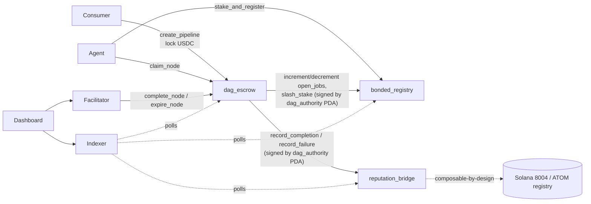

# ChainPipe

**Atomic multi-agent pipeline escrow and bonded trust on Solana.**

> Live on **Solana devnet**. Three Anchor programs + a TypeScript SDK + an x402-style
> facilitator + an indexer + a Next.js 15 dashboard. See [`DEPLOYED.md`](./DEPLOYED.md)
> for live program IDs.

> **Status: devnet prototype.** Core flows + an optimistic-settlement **dispute layer**
> with **content-addressed proof-of-delivery** and a **production-hardening** pass
> (emergency pause, configurable dispute window, per-incident slash cap, two-step operator
> transfer) are implemented and tested (52 program tests). Trust is currently a centralized
> facilitator-arbiter (v1) and value is play-money. See [`SECURITY.md`](./SECURITY.md) for
> the trust model and [`DECENTRALIZATION.md`](./DECENTRALIZATION.md) for the path beyond it.
> The `reputation_bridge` program is ChainPipe's own; it is **designed to be composable with**
> the official Solana 8004 / ATOM registry (forward integration, not a live tie-in).
>
> **Live:** dashboard https://chainpipe.vercel.app · indexer
> https://chainpipe-indexer.fly.dev · facilitator https://chainpipe-facilitator.fly.dev ·
> npm `@chainpipe/solana`
>
> **New to ChainPipe?** Read the plain-language [Product & Architecture Guide](./docs/PRODUCT.md)
> — what it is, the problem it solves, how it works end-to-end, and what's still left to build.

---

## What

Two primitives that close the two hardest gaps in the agent economy:

1. **DAG Pipeline Escrow** (`dag_escrow`) — a consumer locks one budget for a whole
   pipeline of cooperating agents expressed as a DAG. Nodes settle individually as
   their dependencies complete; if a node misses its deadline, anyone can expire it and
   the refund **cascades atomically** to every downstream node and back to the consumer —
   in a single instruction.
2. **Bonded Agent Registry** (`bonded_registry`) — agents stake SPL tokens for a trust
   tier (≥10 / ≥100 / ≥1000 USDC → Tier 1/2/3). Tier gates the work an agent may claim.
   Failure slashes stake to the wronged consumer.

A third program, **`reputation_bridge`**, records per-agent reputation (an EMA score with
a replay-guarded job ledger) and is **facilitator-gated**: only `dag_escrow`, via a
program-derived signer (`[b"dag_authority"]`), can write reputation — so no one can forge
a track record without a real settled job.

### Optimistic settlement + proof-of-delivery

Beyond instant `complete_node`, a node can settle **optimistically with a verifiable
delivery proof**: the agent hosts its output at a content-addressed `uri`, signs
`pipeline ‖ nodeIndex ‖ jobId ‖ sha256(output) ‖ sha256(uri)`, and `submit_completion`
opens a dispute window. **Anyone** can fetch the `uri`, recompute the hash, and compare it
to the on-chain `result_hash` — a mismatch (or an unresolvable `uri`) is objective grounds
to `dispute_node`. No dispute → `finalize_node` pays the agent; a dispute →
`resolve_dispute` (refund + slash, or settle). This makes delivery **integrity, availability,
and authorship trustless**; only subjective "is it good enough" rulings still rest with the
v1 facilitator-arbiter (see [`DECENTRALIZATION.md`](./DECENTRALIZATION.md)).

## Why Solana

Sub-cent fees and ~400 ms slots make per-execution reputation writes and micro-settlements
economically viable at agent scale. Native SPL stablecoins are the payment token, and the
account/PDA model gives every pipeline, node, stake, and reputation record its own
verifiable on-chain account.

## Architecture



```
            stake / slash / open-jobs (CPI)              record_completion / record_failure (CPI)
 bonded_registry  ◀───────────────────────  dag_escrow  ───────────────────────▶  reputation_bridge
   (tier, vault)         signed by               (DAG escrow,          signed by        (EMA, JobRecord
                      dag_authority PDA          cascade refunds)    dag_authority PDA    replay guard)
```

- `sdk/` — `@chainpipe/solana`: pipeline / stake / reputation / discovery helpers (+ IDLs).
- `facilitator/` — Express service: verifies on-chain state, settles/expires nodes, scores jobs.
- `indexer/` — polls devnet, decodes accounts, serves REST + JSON persistence.
- `dashboard/` — Next.js 15, wallet-adapter, 100% Solana-native (zero EVM).
- `scripts/` — `initialize-programs`, `e2e-devnet` (incl. dispute + proof-of-delivery demo),
  `seed-devnet`, `migrate-configs` (hardening migration), `verify-facilitator`.

## Deployed programs (Solana devnet)

| Program | Address |
|---------|---------|
| reputation_bridge | `6RRfs1Ho1bJ3JWXSy3xVth4BTGHWwVwum74ph2LRWWsf` |
| bonded_registry | `26AB6S5crQAkhfx928bnWSHfpQE6wp2Sdt4afFtk7crq` |
| dag_escrow | `3FqvkzppD4ciwkGLrcNoTHUCeHwNbWtot18CkrBdXiJd` |

Full config PDAs and tx signatures in [`DEPLOYED.md`](./DEPLOYED.md).

## Quick start

```bash
# Toolchain: Anchor 0.31.1 (via avm), Solana CLI, Node 20+
npm install

# Build + test all three programs against a local validator (52 tests)
anchor test

# Run the full lifecycle on devnet (real transactions)
npx tsx scripts/e2e-devnet.mts

# Seed demo state (5 agents, 3 pipelines), then run the services + UI
npx tsx scripts/seed-devnet.mts
npm --workspace @chainpipe/indexer start     # :3002
npm --workspace @chainpipe/facilitator start # :3001
npm --workspace @chainpipe/dashboard run dev  # :3000
```

> Build programs with `cargo build-sbf --arch v3` and deploy with
> `solana program deploy ... --program-id keys/<prog>.json`. CPI-dependency crates
> (`reputation_bridge`, `bonded_registry`) must be built standalone via `--manifest-path`
> before `dag_escrow`.

## SDK

```ts
import {
  stakeAndRegister, createPipeline, claimNode, getAgentReputation, DEVNET_ADDRESSES,
} from "@chainpipe/solana";

// Stake to register at a tier
await stakeAndRegister(connection, agent, 100_000_000n, usdcMint, DEVNET_ADDRESSES);

// Lock a 2-node pipeline (node 1 depends on node 0)
await createPipeline(connection, consumer, [
  { allocationUsdc: 40_000_000n, deadlineSlotsFromNow: 9000n, dependencyMask: 0n, requiredTier: 1 },
  { allocationUsdc: 35_000_000n, deadlineSlotsFromNow: 9000n, dependencyMask: 0b001n, requiredTier: 1 },
], DEVNET_ADDRESSES);

// Read reputation
const rep = await getAgentReputation(connection, agentPubkey, DEVNET_ADDRESSES);
```

## Differentiation

| | Per-job x402 facilitators | Official 8004 registry | **ChainPipe** |
|---|---|---|---|
| Multi-job atomicity | ❌ per-job only | n/a | ✅ DAG escrow + cascade refunds |
| Economic stake-for-trust | ❌ | ❌ | ✅ bonded registry + slashing |
| Gated reputation writes | n/a | ❌ un-gated attestation | ✅ CPI-only via `dag_authority` |
| Verifiable proof-of-delivery | ❌ | ❌ | ✅ content-addressed hash + dispute window |

## Demo

A 2–3 minute screen recording walks the full loop — faucet → stake → create pipeline →
claim → submit-with-proof → (dispute | finalize) → reputation update. Recording script:

1. `/my/stake` — faucet test USDC, stake to register at a tier.
2. `/pipeline/create` — build a 2-node DAG, lock the budget.
3. `/work` — claim a node, paste a delivery URL, **Submit + proof** (signs the delivery message).
4. `/pipeline/[pda]` — as the consumer, **Verify delivery** (sha256 match), then either
   **Dispute** (→ refund + slash) or let the window elapse and **Finalize** (→ agent paid).
5. `/agent/[pubkey]` — see the updated EMA reputation.

> _Video link: TBD (record against the live devnet deployment)._

## License

MIT
